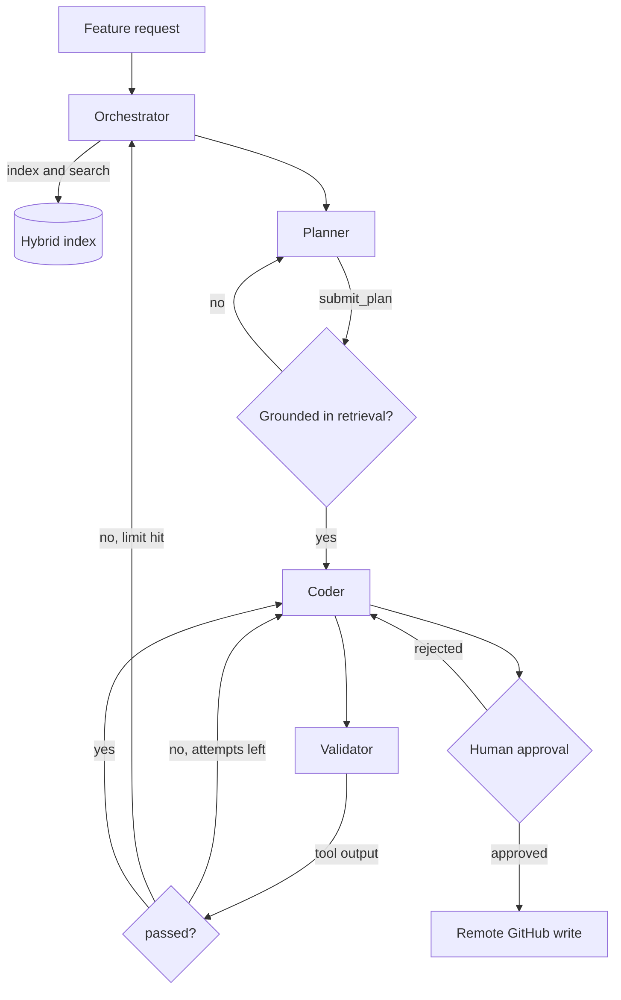

# CodeForge

CodeForge takes a feature request for an existing Python repository, retrieves the
code that request actually depends on, writes a plan that is checked against what
retrieval returned, implements it on a local branch, runs the tests, and asks a human
before anything is pushed.

Four agents share one LangGraph state. All file, git, and GitHub access happens over
MCP. Two of the safety properties are enforced in code rather than in prompts, which
is the part I care most about.

## Guardrails

The planner cannot invent file paths. Every result from `search_repository` is
recorded in `state.retrieved_paths`, and `submit_plan` is rejected when
`files_to_touch` names a file retrieval never returned. The planner gets sent back to
search, so invented paths never reach the coder.

The validator cannot report its own pass. `validation_status` is read from the
`passed` field of the `validate_repository` tool output. Remote writes check that
field, so a model claiming success does not unlock anything.

Every path resolves inside `REPOSITORY_ROOT`. Writes to `main`, `master`,
`production`, and `release` are refused. Each remote GitHub call pauses the graph with
a LangGraph `interrupt` until a person approves it.

## Workflow



| Agent | Job | Cannot |
|---|---|---|
| Orchestrator | Index the repository, retrieve context, delegate, close the run | Plan or edit code |
| Planner | Name the exact files and steps, grounded in retrieval | Edit code, or name unretrieved files |
| Coder | Branch, implement, add tests, refresh the index | Push before validation and approval |
| Validator | Run the checks and explain the failures | Decide the pass or fail itself |

Roles are defined by prompts. `agents.build_agent(role, llm, tools)` binds the same
model to a different system prompt, so adding a role means adding a prompt.

Control moves with one `handoff(target, reason)` tool. A short tool list helps
smaller models pick the right destination.

## Hybrid retrieval

Python files are chunked with the AST into module, class, function, and method units.
Nested classes and methods keep qualified names like `AuthService.Cache.get`, so a
citation points at a real symbol.

Search runs two passes and fuses them:

- dense: local ONNX MiniLM embeddings through ChromaDB, cosine distance
- lexical: BM25 over tokens split on camelCase and snake_case, so `refresh_token`
  matches `refreshTokenStore`
- fusion: reciprocal rank fusion, which merges by position so the two score scales
  never have to be calibrated against each other

Dense retrieval alone is weak on exact identifiers, which is most of what a coding
agent looks for. `mode` can be `dense`, `lexical`, or `hybrid`, so the difference can
be measured instead of assumed.

## Evaluation without hand labelling

Retrieval benchmarks for code usually need someone to write queries and mark the
relevant files. This one mines the ground truth from the repository's own history: a
commit subject reads like a feature request, and the Python files that commit touched
are the files a good retriever should surface.

```bash
python -m codeforge.retrieval.benchmark /absolute/path/to/repository 60
```

That prints recall@k and MRR for all three modes over the last 60 commits, so any git
repository doubles as a labelled test set. Commits touching more than `max_files`
files are skipped, since a wide refactor has no focused answer.

On `pallets/itsdangerous` (last 60 commits, 13 usable cases, k=10):

| mode | recall@10 | MRR |
| --- | --- | --- |
| dense | 0.18 | 0.38 |
| lexical | 0.59 | 0.62 |
| hybrid | 0.55 | 0.53 |

Lexical wins here and hybrid does not beat it. Commit subjects are short and full of
identifiers, which is the case BM25 is good at, and fusing in a weak dense ranking
costs a few positions. The point of having the harness is that this shows up as a
number instead of a guess. On a repository with wordier commit messages the ordering
may well flip, which is why `mode` stays a search argument.

Runtime events also append to `run_log.jsonl`: tool calls and latency, retrieval
queries, rejected plans, and validation outcomes. `telemetry.summarize` rolls a run up.

## Setup

Prerequisites: Python 3.12+, `uv`, Node.js with `npx` for the filesystem and GitHub
MCP servers, an LLM API key, and a fine-grained GitHub token only if you want remote
writes.

```bash
uv sync --all-groups
cp .env.example .env
```

Without `uv`:

```bash
python -m venv .venv
.venv/Scripts/python -m pip install -e . pytest pytest-asyncio ruff
```

Set at least:

```dotenv
LLM_MODEL=openrouter/openai/gpt-4o-mini
OPENROUTER_API_KEY=your_key
REPOSITORY_ROOT=/absolute/path/to/the/python/repository
GITHUB_PERSONAL_ACCESS_TOKEN=your_fine_grained_token
```

Then run it:

```bash
uv run langgraph dev
```

MCP servers are started by `MultiServerMCPClient` from `langchain-mcp-adapters` using
`mcp_servers.json`, so there is nothing extra to launch by hand. To go without
Studio:

```bash
uv run python -m codeforge.graph "Add refresh-token support to the auth service"
```

Resume after an approval pause with `Command(resume={"approved": true})`, once you
have read the tool and arguments shown in the interrupt.

## Tests

```bash
uv run pytest -q
uv run ruff check src tests
```

## Verified project stats

Validation was run from a clean Python 3.12 virtual environment before publication.
The runtime log was redirected to a temporary writable path so the tests exercised
telemetry without modifying the project checkout.

| Check | Verified result |
|---|---:|
| Python source compilation | 28 of 28 files compiled |
| Pytest suite | 40 passed in 1.88s |
| Ruff lint | All checks passed |
| Potential secret files detected | 0 |
| Files published | 34 |

These figures describe the reviewed publication snapshot; rerun the commands above
after making changes.

## Known limits

- Chunking is Python only.
- Fusion is rank based with no cross-encoder reranker.
- Chroma collections are local and specific to one repository path.
- Passing tests is not proof of correctness when the target repository tests little.
- Commit subjects are noisy labels, though they are cheap and carry no bias from
  whoever writes the queries.
